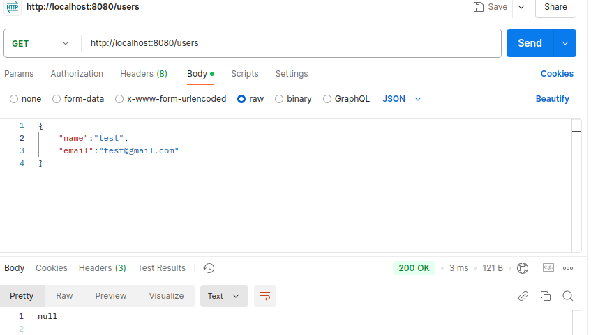
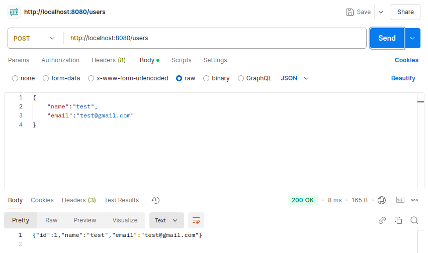
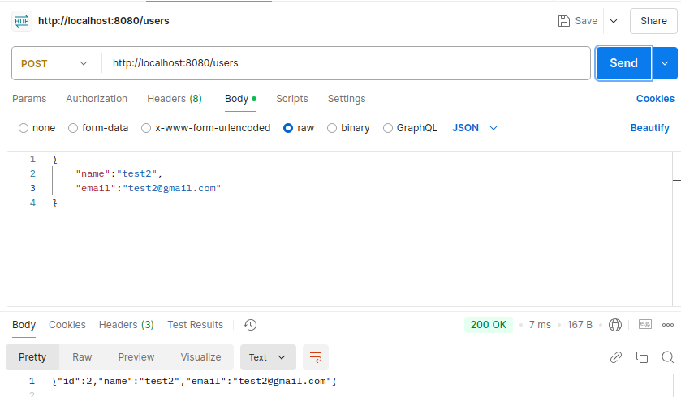
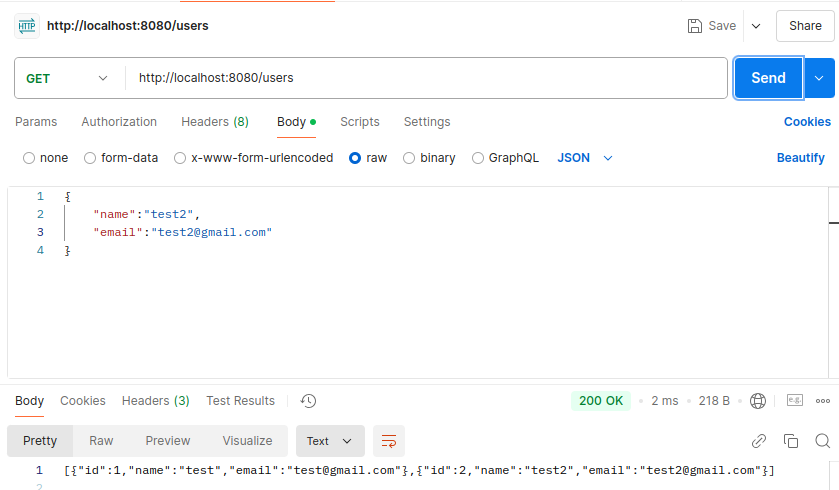
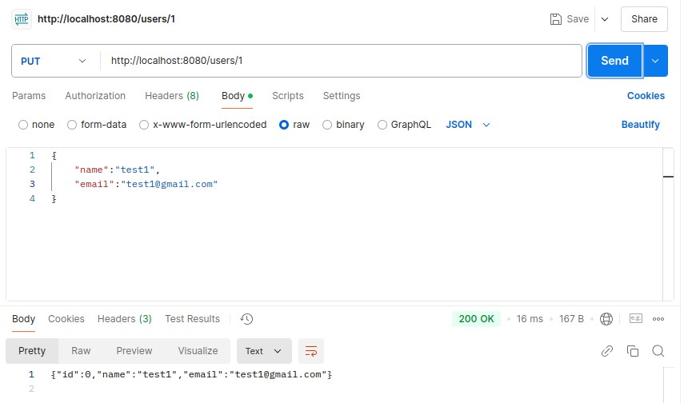
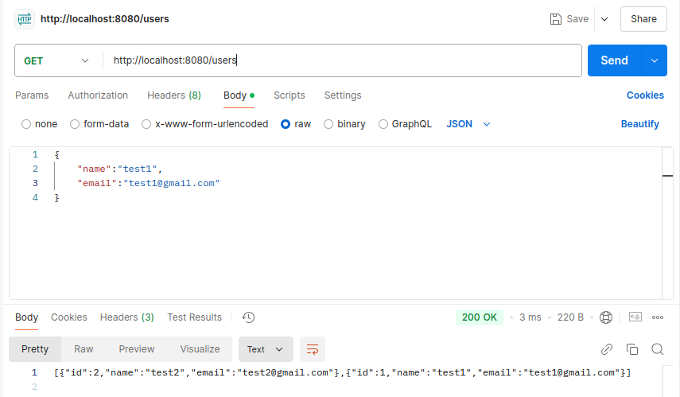
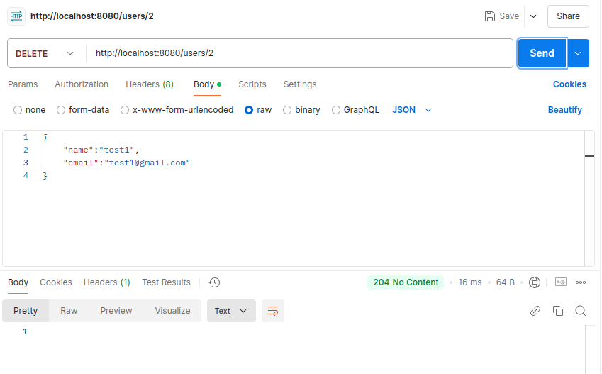
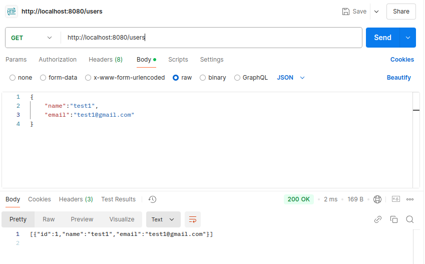

# Go CRUD Application with Gorilla Mux and PostgreSQL

This project is a simple Go microservice that demonstrates CRUD (Create, Read, Update, Delete) operations using the Gorilla Mux router and a PostgreSQL database. The application is dockerized using Docker and Docker Compose for easy setup and deployment.

## Features

- **Create**: Add new users to the database.
- **Read**: Retrieve user information from the database.
- **Update**: Modify existing user information.
- **Delete**: Remove users from the database.

## Technologies Used

- **Go (Golang)**: Programming language used for the microservice.
- **Gorilla Mux**: HTTP router and URL matcher for building Go web servers.
- **PostgreSQL**: Relational database management system for storing user data.
- **Docker & Docker Compose**: Containerization tools for packaging and deploying the application.

## Getting Started

### Prerequisites

- Docker
- Docker Compose

### Running the Application

Clone the repository:

    git clone https://github.com/KaranSinghBisht/go-crud.git
    cd go-crud

Build and run the Docker containers:

    docker-compose up --build

This command will build the Docker images and start the application and database containers.

Access the API at [http://localhost:8080](http://localhost:8080).

## API Endpoints

- `GET /users` - Retrieve all users.
- `POST /users` - Create a new user.
- `PUT /users/{id}` - Update an existing user.
- `DELETE /users/{id}` - Delete a user.

## Demonstration of CRUD Operations

1. **Retrieve Users (GET)**

   Initially, the database is empty. When we make a GET request to `/users`, we receive an empty array.
   

3. **Create Users (POST)**

   We create new users by making POST requests to `/users` with the user's name and email in the request body (in JSON format).

   **First User Creation:**

       {
         "name": "test",
         "email": "test@example.com"
       }
   
   
   **Second User Creation:**

       {
         "name": "test2",
         "email": "test2@example.com"
       }
   

5. **Retrieve Users After Creation (GET)**

   After adding users, making a GET request to `/users` returns the list of users in the database.
   
6. **Update a User (PUT)**

   We can update an existing user's information by making a PUT request to `/users/{id}` with the updated data.

   **Updating User with ID 1:**

       {
         "name": "test1",
         "email": "test1@example.com"
       }
    
7. **Retrieve Users After Update (GET)**

   After updating, we can retrieve the users to see the changes.
    
8. **Delete a User (DELETE)**

   We can delete a user by making a DELETE request to `/users/{id}`.

   **Deleting User with ID 1:**

       DELETE /users/1
    
9. **Retrieve Users After Deletion (GET)**

   After deletion, the user is removed from the database.
    
   
